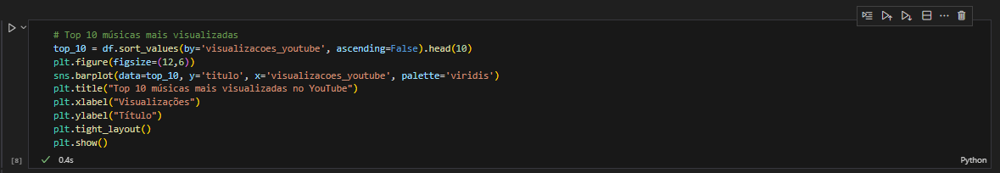
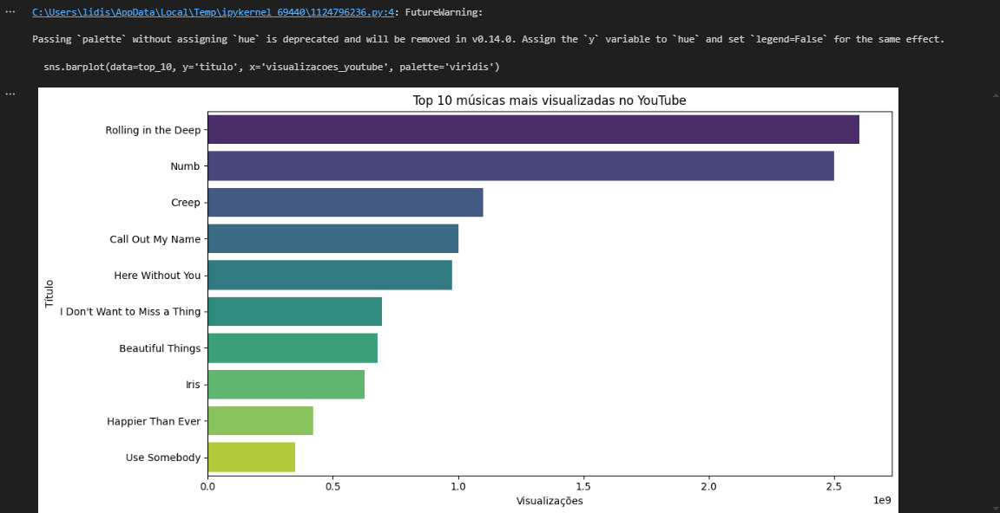
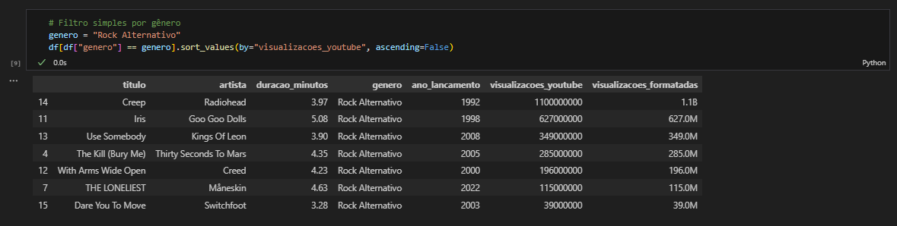
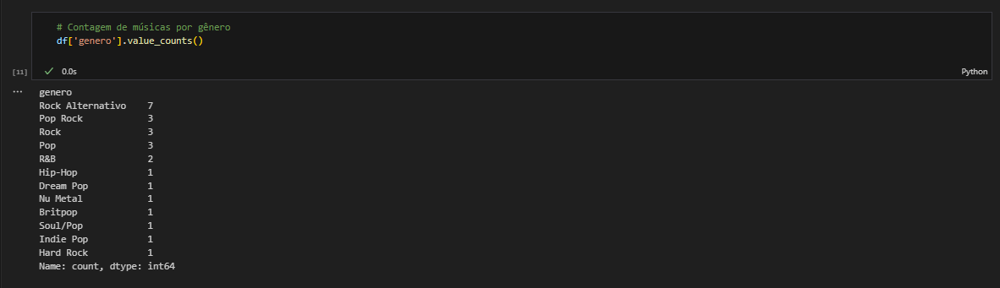
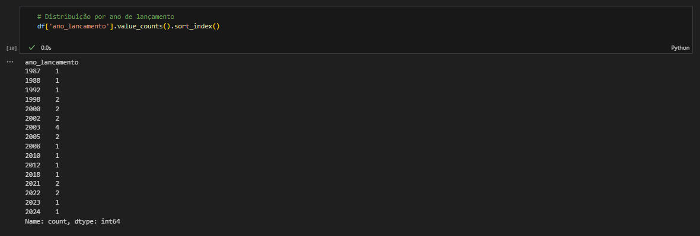

# 🎵 Projeto ETL - Biblioteca de Músicas

Este projeto realiza um pipeline ETL (Extração, Transformação e Carga) sobre uma coleção de músicas de diferentes artistas e estilos, com o objetivo de gerar insights a partir das informações.

## 🗂️ Estrutura do projeto

- 📁 `data/musicas.csv`: arquivo original com dados das músicas.
- 📓 `notebooks/musica_etl_pipeline.ipynb`: notebook com o pipeline ETL, transformações e análises.
- 📄 `output/musicas_tratadas.csv`: arquivo CSV gerado após as transformações.
- 🖼️ `prints/´ – capturas de tela com os resultados e gráficos
  
## 🔄 Pipeline ETL

- 📥 **Extração (Extract)**: dados em CSV com colunas como título, artista, gênero e avaliação
- 🔧 **Transformação (Transform)**: limpeza, análise e enriquecimento dos dados
- 📤 **Carregamento (Load)**: exportação para novo CSV ou visualização interativa

## 📊 Visualizações

### Top 10 músicas mais visualizadas




### Filtro simples de gênero


### Contagem de músicas por gênero


### Distribuição por ano de lançamento


## ▶️ Como executar

1. Clone o repositório:
   ```bash
   git clone https://github.com/seuusuario/musicas-etl.git
   cd musicas-etl
